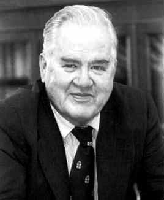
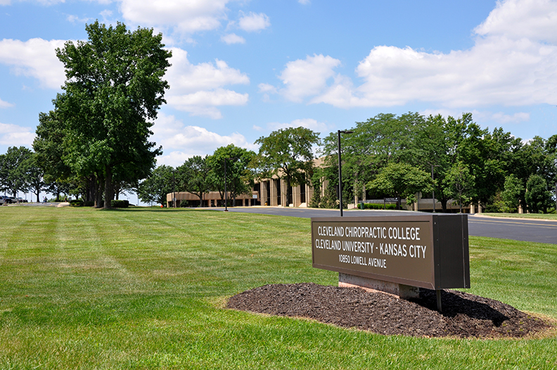
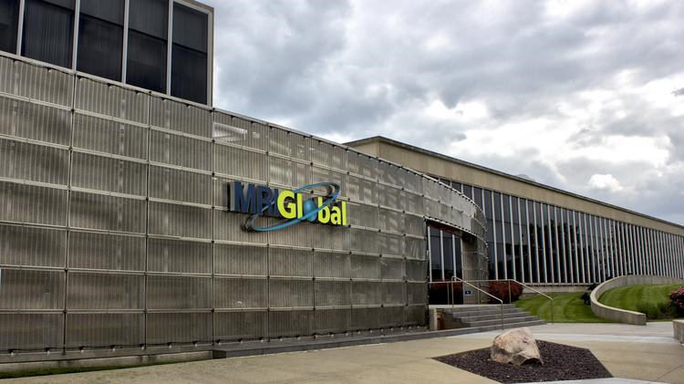
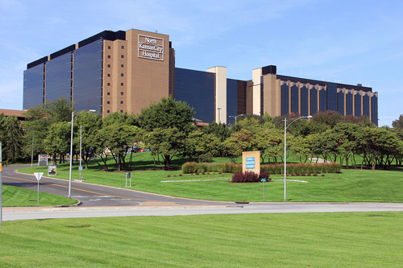
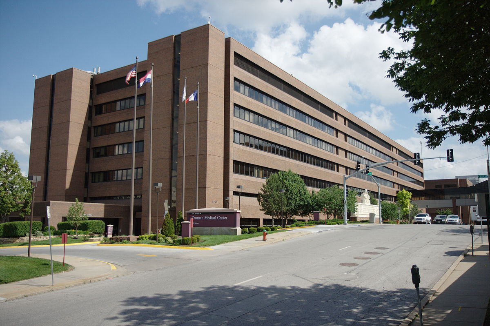
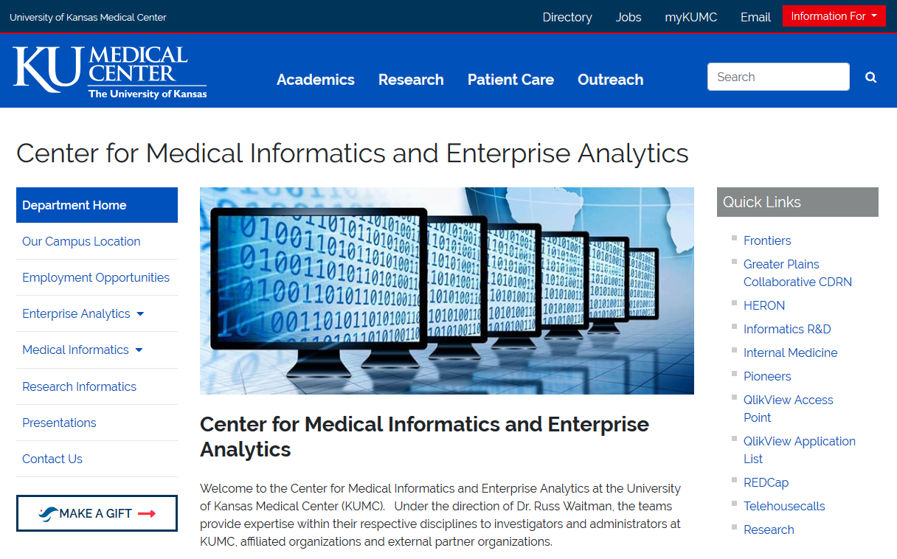
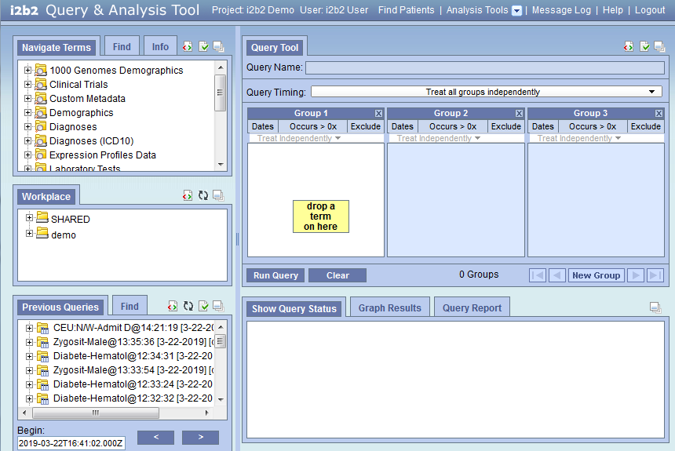
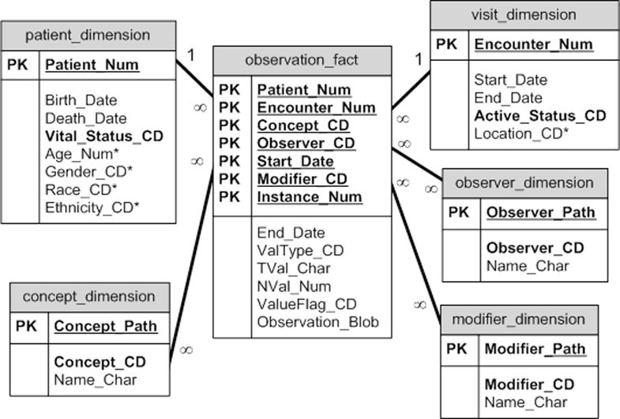

## Not part of the final talk: Introduction

I have been invited to give a talk at the 2019 Midwest BioInformatics Conference (note the unusual capitalization)! I will prepare the talk in this file. For now, I want to keep some material up front and center as I develop this talk. This information will be marked with the label "Not part of the final talk."

## Not part of the final talk: Affiliation

I will list my affiliation as Department of Biomedical and Health Informatics, University of Missouri-Kansas City, but I also need to acknowledge Frontiers as the supporting funding.

Here's a quote from [Wu 2018](https://www.nature.com/articles/s41598-018-35487-0).

"The dataset used for analysis described in this study was obtained from KUMC’s HERON clinical data repository which is supported by institutional funding and by the KUMC CTSA grant UL1TR000001 from NCRR/NIH."

## References to put in my bibliography

I want to put these in BibTeX format.

Mei Liu's paper(s) on Acute Kidney Injury. I think that the Wu paper described on the previous page or [Chen 2018](https://www.ncbi.nlm.nih.gov/pubmed/29589567) would be good.


## Not part of the final talk: Faculty Research Symposium

Every year, UMKC hosts a faculty research symposium, where we all get a chance to put up posters bragging about the work we are doing. It might be an opportunity to publicize the May 23 Frontiers Informatics meetup. I might instead do a poster for my work with the Center for Economic Information, but I could still have flyers to hand out about the Frontiers Informatics meetup.

Join the Office of Research Services for the 5th annual faculty research symposium, an all-faculty exchange of research, scholarship and creative activity. The Faculty Research Symposium is 2 to 4 p.m. Wednesday, April 24 in the Student Union Room 401. Online registration ends Wednesday, April 17. Contact Leslie Burgess with questions at burgessla@umkc.edu 816-235-1520. From the [UMatters website](https://info.umkc.edu/umatters/save-the-date-april-24-for-faculty-research-symposium/).

## Not part of the final talk: date and location

* April 11-12, 2019
*
* University of Missouri – Kansas City
* Atterbury Student Success Center- Pierson Auditorium
* 5000 Holmes, Kansas City, MO 64110

My talk is on April 11 at a session from 1pm to 2pm on the session titled "Data Structures." The other speaker listed as of 3-12-2019 is Carolyn Lawrence-Dill from the Agronomy and Genetics Department of Iowa State University. From here abstract " Our work has focused on mapping genomes and gene elements, predicting gene function, inventing new ways to link genes to phenotypic descriptions and images, developing ways to compute on phenotypic descriptions, organizing broad datasets for community access and use, and developing computational tools that enable others to do all of these sorts of analyses directly" 

## Not part of the final talk: format

A panel moderator will introduce the theme of the panel and the speaker. Each speaker will have 8-10 minutes. Questions will be saved for the open discussion at the conclusion of each panel.

If you exceed 10 minutes, a member of the conference team will prompt you to conclude.  

## Not part of the final talk: content

The conference will include participants from the full spectrum of informatics, from bioinformatics analysis of genome or proteome data to statistical analysis of clinical data related to large populations.

* Social media – If you are on Twitter, include your handle (e.g., @bionexuskc) in your opening slide.  
* Accessible - As you prepare your presentation, consider a brief explanation of the problem, technology or methodology in terms that will make your presentation accessible to the full audience.
* Visual – Consider using visuals instead of dense text as often as possible

## Not part of the final talk: Video and other special requirements

* Please communicate with Shaylee Yount (syount@bionexuskc.org) about any of the following elements that you plan to include:
  +	Video stored locally
  +	Active navigation through a web site 

* Note: I do not intend to use these.

## Not part of the final talk: submitting your presentation, deadline

Please send your presentation as a PowerPoint file to Shaylee Yount (syount@bionexuskc.org) by Friday March 28th at 5:00 pm.  

Spread the word! – As a speaker, we hope that you will generate excitement about the conference in your community.  Please encourage your students, colleagues, collaborators and community to participate.   We would like to have a high level of student participation and will appreciate it if you encourage students and postdocs to submit posters.  Please share the link to the conference, Tweet about your presentation using our hashtag #MWBio19.

## Not part of the final talk: conference website

You can find my smiling face among the presenters on the conference website (about two thirds of the way down).

* http://kcbioinformatics.org/conference/speakers/

They posted a short bio at

* http://kcbioinformatics.org/conference/speakers/stephen-simon-phd/

According to the agenda, I am talking on the first day (Thursday, April 11) in the first afternoon session, Data Structure, from 1pm to 2pm.

* http://kcbioinformatics.org/conference/agenda/

## Not part of the final talk: My abstract

The electronic health record (EHR) offers opportunities for research and quality improvement studies that did not exist before. Data mining, discovering new and unexpected patterns in the data, requires a different mode of access for EHR data than more traditional hypothesis driven studies. This talk will cover the specialized statistical and programming skills needed for data mining.

## Not part of the final talk: General structure of the talk

I only have ten minutes, so I need to be judicious in what I cover. I want to frame my talk around the famous quote by John Tukey: "The best thing about being a statistician is that you get to play in everyone's backyard."

I think I have time to slip in a bit of trivia about Dr. Tukey: he invented the boxplot and coined the terms "software" and "bit" (short for binary digit).

On the final slide, I will show the session we have planned for the Frontiers Informatics meetup (open data clinical platforms) on May 23 and refer back to the quote with something along the lines of "if you have an interesting backyard, I want to see you there."

## Not part of the final talk: General structure, continued

In ten minutes, I only have time to make three points.

1. If you are interested in data mining, you have to move past the i2b2 software and data builder, and access the data directly with SQL. This requires multiple self-joins

2. The nature of the electronic health record creates a data structure well suited for the sparse matrix format

3. Data mining includes mining information from the metadata.

## Not part of the final talk: Things to emphasize

Place in the context of i2b2, which is an open standard.

Open Clinical Data Analytic Platform.

## John Tukey



## Some of my backyards

Academic Emergency Medicine, American Journal of Audiology, American Journal of Kidney Diseases, Annals of Allergy, Asthma & Immunology, Annals of Behavioral Medicine, Annals of Occupational Hygiene, Applied Clinical Informatics, Applied Occupational and Environmental Hygiene, Archives of Dermatology, Archives of Pediatrics & Adolescent Medicine, Birth Defects Research. Part A, Clinical and Molecular Teratology, BMJ (Clinical Research Ed.), Cancer Letters, Cell Death & Disease, Child Maltreatment, Clinical Nephrology, Clinical Pharmacology and Therapeutics, Clinical Toxicology, Endocrinologist, Genomics, Hospital Pharmacy, Journal of Andrology, Journal of Applied Toxicology, Journal of Bone and Joint Surgery, Journal of Clinical Pharmacology, Journal of Clinical Psychology in Medical Settings, Journal of General Internal Medicine, Journal of Human Lactation, Journal of Nursing Administration, Journal of Obstetric, Gynecologic, and Neonatal Nursing, Journal of Occupational and Environmental Medicine, Journal of Pediatric Endocrinology & Metabolism, Journal of Perinatology, Journal of the Acoustical Society of America, Journal of the American Academy of Dermatology, Journal of the American Society of Echocardiography, Journal of the International AIDS Society, Molecular Andrology, Occupational Hygiene, Pediatric Blood & Cancer, Pediatric Cardiology, Pediatric Emergency Care, Pediatric Nephrology, Pediatrics, Perception & Psychophysics, Pharmacogenetics, Reproductive Biomedicine Online, Reproductive Toxicology, Scanning Microscopy, Seminars for Nurse Managers.

<div class="notes">

I've had the opportunity myself to publish in fifty different medical journals. It's skewed a bit to the pediatric side of things, but still represents a broad range of disciplines.

</div>

## Some of my backyards


## Some of my backyards



## Some of my backyards



## Some of my backyards



## Some of my backyards



## Some of my backyards


<div class="notes">

But more than anything, I consider myself to be half Kangaroo and half Jayhawk.

</div>

## Some of my backyards



<div class="notes">

So when I was offered a chance to work on the Medical Informatics with Russ Waitman, I jumped at the chance. Now they hated me at UMKC, for this. I had child care commitments and had to drop some really good things at UMKC in order to free up enough time to work with Russ. But I decided I had to do this, because Medical Informatics is just like Statistics. They also get to play in everyone's backyard.

</div>

## Mining the Electronic Health Record

What is data mining?

* "Data mining is the process of finding anomalies, patterns and correlations within large data sets" (SAS Institute)

What is the electronic health record

* "An electronic health record (EHR) is a digital version of a patient’s paper chart. EHRs are real-time, patient-centered records that make information available instantly and securely to authorized users." (healthit.gov)

## i2b2 software



## The database structure behind the i2b2 software



## Requirements needed for mining the electronic health record

Technical requirements
* Working familiarity with SQL
* Data wrangling skills
Non-technical requirements
* Lust for data
* An interesting backyard

## How many surgeries?

```{r select-surgeries, eval=FALSE}
select_surgeries <- 
  "SELECT name_char FROM blueherondata.concept_dimension
     WHERE name_char LIKE '%ectomy%'"
dbGetQuery(c_connect, select_surgeries) %>%
  use_series(NAME_CHAR) %>%
  strsplit(" ") %>%
  unlist %>%
  tolower %>%
  grep("ectomy", ., value=TRUE) %>%
  gsub("[[:punct:]]", "", .) %>%
  gsub("ectomy.*", "-", .) %>%
  unique %>%
  sample(100, replace=FALSE) %>%
  sort %>%
  paste(collapse=", ")
```

## Bobby tables cartoon


## How many surgeries?

"adenoid-, adrenal-, apico-, arytenoid-, cervic-, cord-, costotransvers-, craniotomycrani-, crypt-, disk-, empyem-, epiplo-, fissur-, hemigloss-, hemilaryng-, hemiphalang-, hemispher-, hepat-, hypophys-, iridotomyirid-, kerat-, kyph-, mastoid-, mucos-, myom-, nephr-, oophor-, opercul-, orchi-, ost-, parathyroid-, pericardi-, pharyngolaryng-, plex-, pneumon-, polyp-, postadenoid-, postcholecyst-, posthyster-, postlymphaden-, posttonsill-, sphenoid-, stern-, synov-, tenosynov-, tracheostomylaryng-, tyl-, tympanosympath-, umbil-, vesicul-"

## How many surgeries?

"acromion-, adenoid-, alveol-, apic-, apico-, arthr-, arytenoid-, astragal-, ather-, burs-, capsul-, carp-, clitor-, coccyg-, crani-, dacryoaden-, dacryocyst-, diaphys-, disarticulationhemipelv-, disk-, diverticul-, endarter-, epididym-, epiglottid-, epiplo-, ethmoid-, fasci-, fistul-, frenul-, ganglion-, gastr-, gingiv-, gloss-, hemigastr-, hemigloss-, hemilamin-, hemilaryng-, hemiphalang-, hemorrhoid-, hepat-, hymen-, hyster-, infundibul-, irid-, labyrinth-, lamin-, lip-, lump-, mucos-, my-, myom-, nephr-, nephroureter-, oophor-, osteophyt-, pannicul-, patell-, phalang-, pharyngolaryng-, phleb-, pleur-, plex-, pneumon-, postadenoid-, postcholecyst-, postgastr-, postlymphaden-, postmastoid-, postpolyp-, postprostat-, postsplen-, prostat-, rectosigmoid-, salping-, salpingoophor-, scler-, segment-, sequestr-, sialoaden-, sigmoid-, sphenoid-, sympath-, synov-, tenon-, tenosynov-, trabecul-, trachel-, trisection-, trisegment-, turbin-, tyl-, tympanomastoid-, umbil-, urethr-, uvul-, vagin-, valv-, vas-, vesicul-, vulv-"

## Bibliography

You can find more information at

* https://github.com/kumc-bmi/heron-i2b2-analytics

In particular, look for

* doc/mining-v2-image-credits.txt
* doc/mining-v2-bibliography.html.
* doc/mining-v2-slides.pptx