## How many researchers...?


<div class="notes">

Let's start with a bad joke. How many researchers does it take to screw in a lightbulb? Fifteen. One to screw in the lightbulb and fourteen to serve as co-authors.

I have to admit I'm one of those fourteen. I written some of my own articles, but some of my best work is when I'm third, fifth, or eight co-author.

</div>

## The best thing about being a statistician...

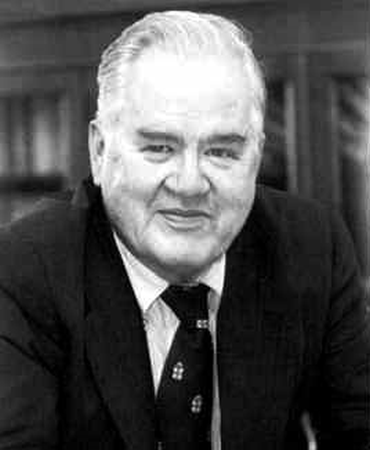

<div class="notes">

I'm in strong agreement with the famous statistician, John Tukey, who said "The best thing about being a statistician is that you get to play in everyone's backyard." 

</div>

## Backyard #1

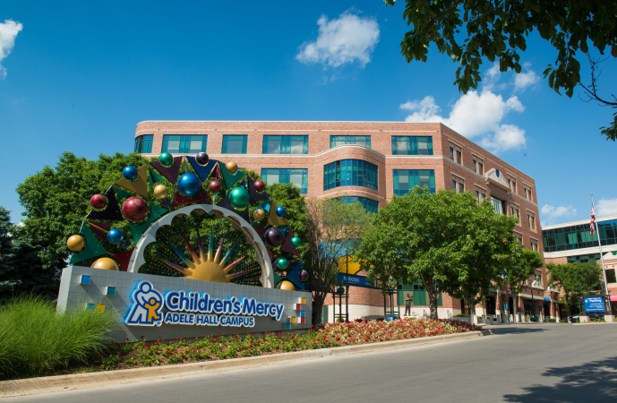

<div class="notes">

Here are some of the local backyards I've gotten to play in. Children's Mercy, ...

</div>

## Backyard #2

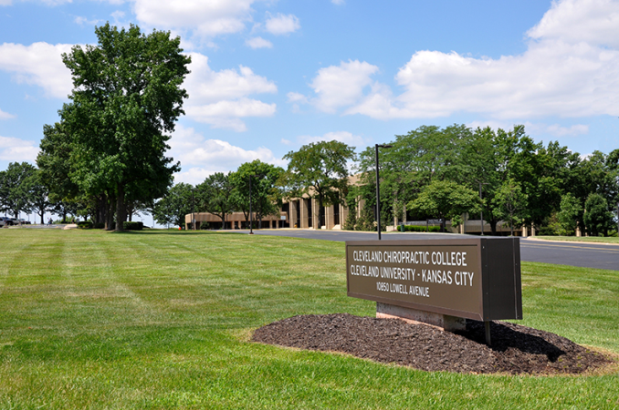

<div class="notes">

..., Cleveland Chiropractic, ...

</div>

## Backyard #3

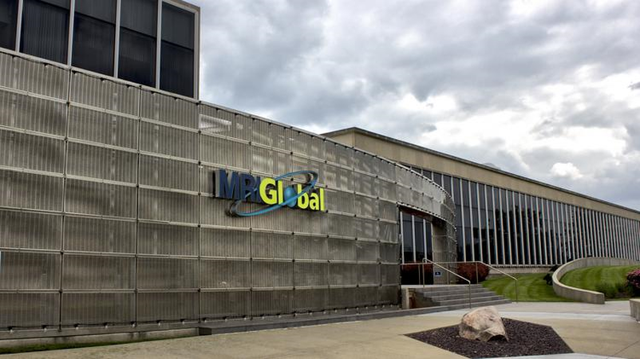

<div class="notes">

..., MRI Global, ...

</div>

## Backyard #4

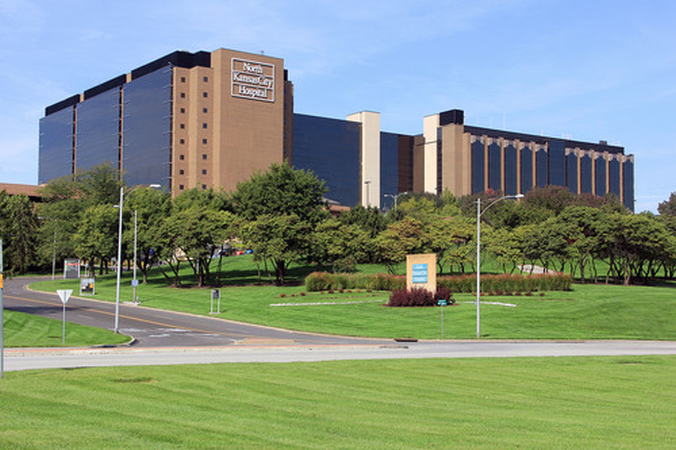

<div class="notes">

..., North Kansas City Hospital, ...

</div>

## Backyard #5

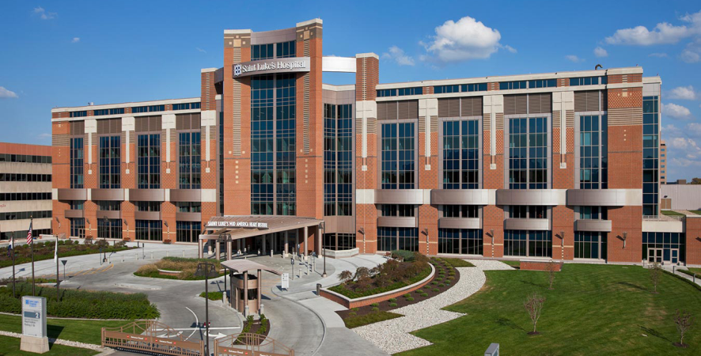

<div class="notes">

..., Saint Luke's Hospital, ...

</div>

## Backyard #6

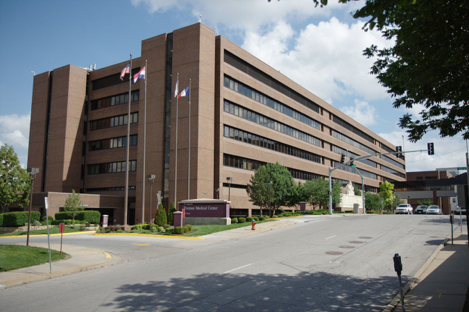

<div class="notes">

..., and Truman Medical Center, ...

</div>

## My favorite two backyards


<div class="notes">

... but my two favorite backyards are UMKC and KUMC. UMKC pays most of my salary, but I have worked on the committee that provided oversight to all the Data Safety and Monitoring Boards at KUMC. I co-authored a several publications on Bayesian models with KUMC faculty. I helped out with the National Database of Nursing Quality Indicators. I provided informal support to one of the first PhD graduates from the Biostatistics Department. So I consider myself to be half Kangaroo and half Jayhawk. Would that be a Kangjay or a Hawkaroo?

</div>

## New backyard: Russ Waitman

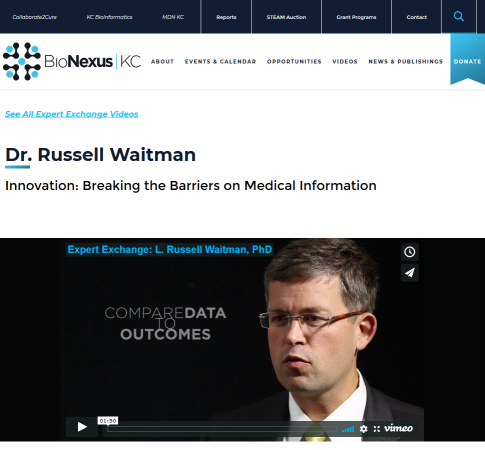

<div class="notes">

So when this guy [pause] offered me a chance to work at KU Med Center in Medical Informatics, I said "Heck yes!" Now this wasn't easy. I had child care commitments and so to find the time to work with Russ I needed to drop some really good things at UMKC. But I had to do this, because Medical Informatics is just like Statistics. They also get to play in everyone's backyard.

</div>

## i2b2 software

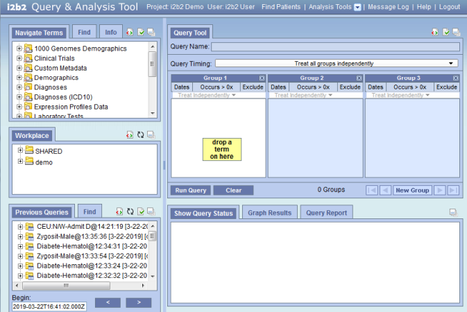

<div class="notes">

The common standard for research using the electronic health record is i2b2. 

It's an open standard which should be attractive to anyone in this audience who is a student. You learn i2b2 here, and everything you learn will transfer directly to the job you get after you graduate.

They are using i2b2 at some of the local playgrounds that I showed earlier: Children's Mercy, Saint Luke's, and Truman Medical Center. But the i2b2 system at KU Med Center is really great. They've included records from both the billing side and the clinical side. How cool is that! They've integrated the electronic health record with a cancer registry and a trauma registry. They have a slick system called data builder, which dumps the i2b2 records into a SQLite database that you can import into R, and they even let mere mortals like me query directly from the actual database.

The i2b2 software is great for targetted research involving a well structured research hypothesis. But for data mining, which is a more unstructured approach, you have to dig a bit deeper.

</div>

## The database structure behind i2b2

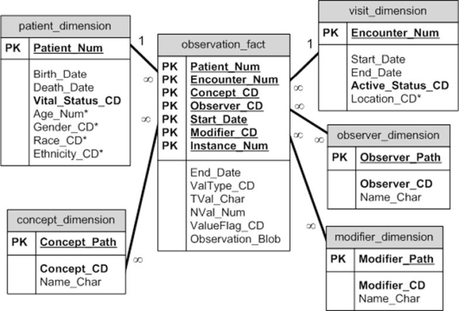

<div class="notes">

Here's the database schema for i2b2. For something as complex as the Electronic Health Record, it's a very spartan design. It has to be, as we'll see in a minute.

</div>

## How many surgeries?

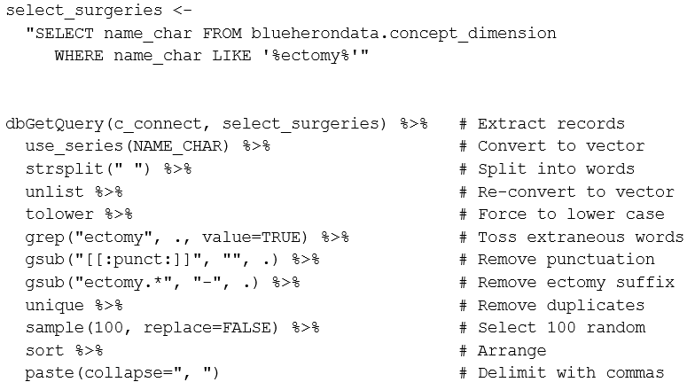
## How many surgeries?

```{r select-surgeries, eval=FALSE}

select_surgeries <- 
  "SELECT name_char FROM blueherondata.concept_dimension
     WHERE name_char LIKE '%ectomy%'"     
dbGetQuery(c_connect, select_surgeries) %>%   # Extract records
  use_series(NAME_CHAR) %>%                   # Convert to vector
  strsplit(" ") %>%                           # Split into words
  unlist %>%                                  # Re-convert to vector
  tolower %>%                                 # Force to lower case
  grep("ectomy", ., value=TRUE) %>%           # Toss extraneous words
  gsub("[[:punct:]]", "", .) %>%              # Remove punctuation
  gsub("ectomy.*", "-", .) %>%                # Remove ectomy suffix
  unique %>%                                  # Remove duplicates
  sample(100, replace=FALSE) %>%              # Select 100 random
  sort %>%                                    # Arrange
  paste(collapse=", ")                        # Delimit with commas

```

<div class="notes">

Here's something simple you can only do easily if you can directly query the database. This is a simple program for getting a list of certain types of operations. You're looking for the suffix "ectomy" which is Greek for "cut it out." Here's a bit of SQL code and some post-processing in R. You should be able to do this in SAS as well, but I haven't tested it yet.

</div>

## How many surgeries?

"acromion-, adenoid-, alveol-, apic-, apico-, arthr-, arytenoid-, astragal-, ather-, burs-, capsul-, carp-, clitor-, coccyg-, crani-, dacryoaden-, dacryocyst-, diaphys-, disarticulationhemipelv-, disk-, diverticul-, endarter-, epididym-, epiglottid-, epiplo-, ethmoid-, fasci-, fistul-, frenul-, ganglion-, gastr-, gingiv-, gloss-, hemigastr-, hemigloss-, hemilamin-, hemilaryng-, hemiphalang-, hemorrhoid-, hepat-, hymen-, hyster-, infundibul-, irid-, labyrinth-, lamin-, lip-, lump-, mucos-, my-, myom-, nephr-, nephroureter-, oophor-, osteophyt-, pannicul-, patell-, phalang-, pharyngolaryng-, phleb-, pleur-, plex-, pneumon-, postadenoid-, postcholecyst-, postgastr-, postlymphaden-, postmastoid-, postpolyp-, postprostat-, postsplen-, prostat-, rectosigmoid-, salping-, salpingoophor-, scler-, segment-, sequestr-, sialoaden-, sigmoid-, sphenoid-, sympath-, synov-, tenon-, tenosynov-, trabecul-, trachel-, trisection-, trisegment-, turbin-, tyl-, tympanomastoid-, umbil-, urethr-, uvul-, vagin-, valv-, vas-, vesicul-, vulv-"

<div class="notes">

The full list of "ectomies" would be about twice as big. And that illustrates a key challenge with this type of data. It is very sparse. There are hundreds of things that a surgeon can cut out of you, but you should be very grateful that the doctor only chops out one or two things at the most. Looking at the drugs that you could get, even the worst polypharmacy cases would be a small fraction of thousands of drugs that are available. The same thing for diagnosis codes. So the design matrix for any regression model in this area becomes really huge and most of the entries are zeros.

The other thing about the electronic health record is that each operation, each drug, each diagnosis code sits on a separate record. It has to, or the record would string out so long that it would be unmanageable. So you can't say "Give me the record for a patient with sleep apnea getting Propofol anesthetic for a septoplasty." Instead, you have to match the apnea record with the Propofol record with the septoplasty records. This means using a self-join. Self-joins are tricky. They usually require using nested queries and they can be very inefficient.

I don't want to scare you away though. Mining the electronic health records has been one of the most fun backyards I've had a chance to play in.

</div>

## Mei Liu, Acute Kidney Injury

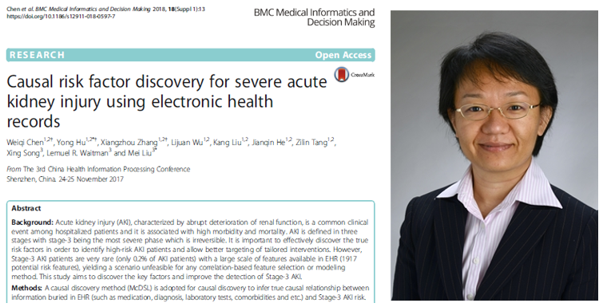

<div class="notes">

Now, what I've shown you so far isn't too fancy, but there's someone else in Medical Informatics, Mei Liu. She has several research publications on Acute Kidney Injury, a big NSF grant, and a PostDoc working with her. She's a lot smarter than I am, but I know all the good light bulb jokes.

</div>

## Requirements needed for mining the electronic health record

Technical requirements

* Working familiarity with SQL
* Data wrangling skills

Non-technical requirements

* Lust for data
* An interesting backyard

<div class="notes">

So if you want to work in this area that I call "Mining the electronic health record" you need four things. You need to have a working knowledge of SQL. Not at the level of a database administrator, but you do have to know how to use the WHERE clause, the various types of joins, and a few other basic things. You also have to be pretty good at data wrangling. Data wrangling is a term that some guy (I'm sure it was a guy) developed to make the term data management sound more macho.

More important than these technical skills is that you have to get excited about data. If you weren't salivating at the code that pulled every whatever-ectomy out of the database, then maybe this isn't for you. The final requirement, though, and one that I am sure you already have, is an interesting backyard. I'm not a doctor, and all the examples I come up with on my own for mining the electronic health record are pretty trivial from a medical perspective. If you can bring me an interesting medical question, I can help you with the SQL and the data wrangling.

</div>

## Informatics meetup

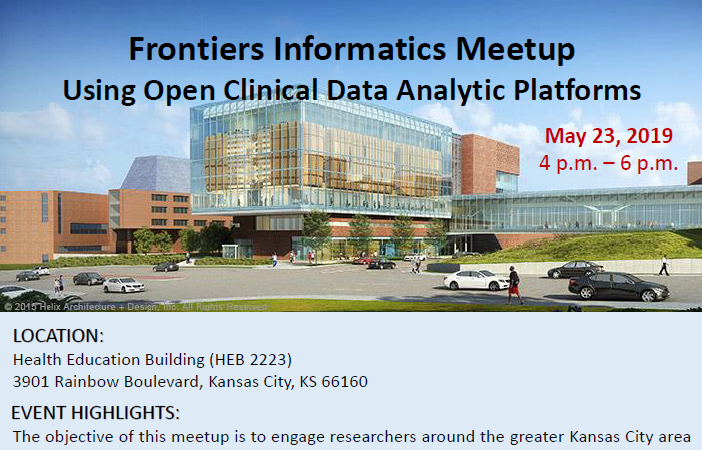

<div class="notes">

If you want to work in this area, we have scheduled an informatics meetup on May 23. We'll have speakers from the beginner's intermediate, and advanced spectrum of data mining. Mei Liu and I will be running the show and we'll bring along with a bunch of others in Russ's department. If you've got an interesting backyard, we want you to be there, too.

</div>

## Where you can find a copy of this talk.

This presentation was developed using R Markdown. You can find all the important stuff at

* https://github.com/kumc-bmi/heron-i2b2-analytics

In particular, look for

* doc/mining-v2-image-credits.txt
* doc/mining-v2-slides.pptx
* doc/mining-v2-speaker-notes.pdf

<!--- commenting out personal notes

## Not part of the final talk: Introduction

I'm listing a few notes here for my benefit as I develop my talk. These notes will be cut out when I produce the final presentation.

I have been invited to give a talk at the 2019 Midwest BioInformatics Conference (note the unusual capitalization)! I will prepare the talk in this file. For now, I want to keep some material up front and center as I develop this talk. This information will be marked with the label "Not part of the final talk."

## Not part of the final talk: Affiliation

I will list my affiliation as Department of Biomedical and Health Informatics, University of Missouri-Kansas City, but I also need to acknowledge Frontiers as the supporting funding.

Here's a quote from [Wu 2018](https://www.nature.com/articles/s41598-018-35487-0).

"The dataset used for analysis described in this study was obtained from KUMC’s HERON clinical data repository which is supported by institutional funding and by the KUMC CTSA grant UL1TR000001 from NCRR/NIH."

## References to put in my bibliography

I want to put these in BibTeX format.

Mei Liu's paper(s) on Acute Kidney Injury. I think that the Wu paper described on the previous page or [Chen 2018](https://www.ncbi.nlm.nih.gov/pubmed/29589567) would be good.


## Not part of the final talk: Faculty Research Symposium

Every year, UMKC hosts a faculty research symposium, where we all get a chance to put up posters bragging about the work we are doing. It might be an opportunity to publicize the May 23 Frontiers Informatics meetup. I might instead do a poster for my work with the Center for Economic Information, but I could still have flyers to hand out about the Frontiers Informatics meetup.

Join the Office of Research Services for the 5th annual faculty research symposium, an all-faculty exchange of research, scholarship and creative activity. The Faculty Research Symposium is 2 to 4 p.m. Wednesday, April 24 in the Student Union Room 401. Online registration ends Wednesday, April 17. Contact Leslie Burgess with questions at burgessla@umkc.edu 816-235-1520. From the [UMatters website](https://info.umkc.edu/umatters/save-the-date-april-24-for-faculty-research-symposium/).

## Not part of the final talk: date and location

* April 11-12, 2019
*
* University of Missouri – Kansas City
* Atterbury Student Success Center- Pierson Auditorium
* 5000 Holmes, Kansas City, MO 64110

My talk is on April 11 at a session from 1pm to 2pm on the session titled "Data Structures." The other speaker listed as of 3-12-2019 is Carolyn Lawrence-Dill from the Agronomy and Genetics Department of Iowa State University. From here abstract " Our work has focused on mapping genomes and gene elements, predicting gene function, inventing new ways to link genes to phenotypic descriptions and images, developing ways to compute on phenotypic descriptions, organizing broad datasets for community access and use, and developing computational tools that enable others to do all of these sorts of analyses directly" 

## Not part of the final talk: format

A panel moderator will introduce the theme of the panel and the speaker. Each speaker will have 8-10 minutes. Questions will be saved for the open discussion at the conclusion of each panel.

If you exceed 10 minutes, a member of the conference team will prompt you to conclude.  

## Not part of the final talk: content

The conference will include participants from the full spectrum of informatics, from bioinformatics analysis of genome or proteome data to statistical analysis of clinical data related to large populations.

* Social media – If you are on Twitter, include your handle in your opening slide.  
* Accessible - As you prepare your presentation, consider a brief explanation of the problem, technology or methodology in terms that will make your presentation accessible to the full audience.
* Visual – Consider using visuals instead of dense text as often as possible

## Not part of the final talk: Video and other special requirements

* Please communicate with Shaylee Yount (syount@bionexuskc.org) about any of the following elements that you plan to include:
  +	Video stored locally
  +	Active navigation through a web site 

* Note: I do not intend to use these.

## Not part of the final talk: submitting your presentation, deadline

Please send your presentation as a PowerPoint file to Shaylee Yount (syount@bionexuskc.org) by Friday March 28th at 5:00 pm.  

Spread the word! – As a speaker, we hope that you will generate excitement about the conference in your community.  Please encourage your students, colleagues, collaborators and community to participate.   We would like to have a high level of student participation and will appreciate it if you encourage students and postdocs to submit posters.  Please share the link to the conference, Tweet about your presentation using our hashtag #MWBio19.

## Not part of the final talk: conference website

You can find my smiling face among the presenters on the conference website (about two thirds of the way down).

* http://kcbioinformatics.org/conference/speakers/

They posted a short bio at

* http://kcbioinformatics.org/conference/speakers/stephen-simon-phd/

According to the agenda, I am talking on the first day (Thursday, April 11) in the first afternoon session, Data Structure, from 1pm to 2pm.

* http://kcbioinformatics.org/conference/agenda/

## Not part of the final talk: My abstract

The electronic health record (EHR) offers opportunities for research and quality improvement studies that did not exist before. Data mining, discovering new and unexpected patterns in the data, requires a different mode of access for EHR data than more traditional hypothesis driven studies. This talk will cover the specialized statistical and programming skills needed for data mining.

## Not part of the final talk: General structure of the talk

I only have ten minutes, so I need to be judicious in what I cover. I want to frame my talk around the famous quote by John Tukey: "The best thing about being a statistician is that you get to play in everyone's backyard."

I think I have time to slip in a bit of trivia about Dr. Tukey: he invented the boxplot and coined the terms "software" and "bit" (short for binary digit).

On the final slide, I will show the session we have planned for the Frontiers Informatics meetup (open data clinical platforms) on May 23 and refer back to the quote with something along the lines of "if you have an interesting backyard, I want to see you there."

## Not part of the final talk: General structure, continued

In ten minutes, I only have time to make three points.

1. If you are interested in data mining, you have to move past the i2b2 software and data builder, and access the data directly with SQL. This requires multiple self-joins

2. The nature of the electronic health record creates a data structure well suited for the sparse matrix format

3. Data mining includes mining information from the metadata.

## Not part of the final talk: Things to emphasize

Place in the context of i2b2, which is an open standard.

Open Clinical Data Analytic Platform.

## [Left out of final talk] Some of my backyards

Academic Emergency Medicine, American Journal of Audiology, American Journal of Kidney Diseases, Annals of Allergy, Asthma & Immunology, Annals of Behavioral Medicine, Annals of Occupational Hygiene, Applied Clinical Informatics, Applied Occupational and Environmental Hygiene, Archives of Dermatology, Archives of Pediatrics & Adolescent Medicine, Birth Defects Research. Part A, Clinical and Molecular Teratology, BMJ (Clinical Research Ed.), Cancer Letters, Cell Death & Disease, Child Maltreatment, Clinical Nephrology, Clinical Pharmacology and Therapeutics, Clinical Toxicology, Endocrinologist, Genomics, Hospital Pharmacy, Journal of Andrology, Journal of Applied Toxicology, Journal of Bone and Joint Surgery, Journal of Clinical Pharmacology, Journal of Clinical Psychology in Medical Settings, Journal of General Internal Medicine, Journal of Human Lactation, Journal of Nursing Administration, Journal of Obstetric, Gynecologic, and Neonatal Nursing, Journal of Occupational and Environmental Medicine, Journal of Pediatric Endocrinology & Metabolism, Journal of Perinatology, Journal of the Acoustical Society of America, Journal of the American Academy of Dermatology, Journal of the American Society of Echocardiography, Journal of the International AIDS Society, Molecular Andrology, Occupational Hygiene, Pediatric Blood & Cancer, Pediatric Cardiology, Pediatric Emergency Care, Pediatric Nephrology, Pediatrics, Perception & Psychophysics, Pharmacogenetics, Reproductive Biomedicine Online, Reproductive Toxicology, Scanning Microscopy, Seminars for Nurse Managers.

<div class="notes">

Here are some of the backyards that I've played in. I left out all those boring Statistics journals. I deliberately let this scroll off the page to make it look more impressive. There are fifty different journals here, skewed a bit perhaps to the pediatric side, but otherwise quite a broad representation. 

</div>

## [Left out of final talk] Bobby tables cartoon


## [Left out of final talk] How many surgeries?

"adenoid-, adrenal-, apico-, arytenoid-, cervic-, cord-, costotransvers-, craniotomycrani-, crypt-, disk-, empyem-, epiplo-, fissur-, hemigloss-, hemilaryng-, hemiphalang-, hemispher-, hepat-, hypophys-, iridotomyirid-, kerat-, kyph-, mastoid-, mucos-, myom-, nephr-, oophor-, opercul-, orchi-, ost-, parathyroid-, pericardi-, pharyngolaryng-, plex-, pneumon-, polyp-, postadenoid-, postcholecyst-, posthyster-, postlymphaden-, posttonsill-, sphenoid-, stern-, synov-, tenosynov-, tracheostomylaryng-, tyl-, tympanosympath-, umbil-, vesicul-"

## [Left out of final talk] Mining the Electronic Health Record

What is data mining?

* "Data mining is the process of finding anomalies, patterns and correlations within large data sets" (SAS Institute)

What is the electronic health record

* "An electronic health record (EHR) is a digital version of a patient’s paper chart. EHRs are real-time, patient-centered records that make information available instantly and securely to authorized users." (healthit.gov)

<div class="notes">

My job/ Mining the electronic health record. Now, I really don't have to define these terms for this audience, but I'll do it anyway. SAS Institute defines data mining as the search for anomalies, patterns, or correlations. The government defines the electronic health record as a digital version of a patient's paper chart. 

</div>

--->