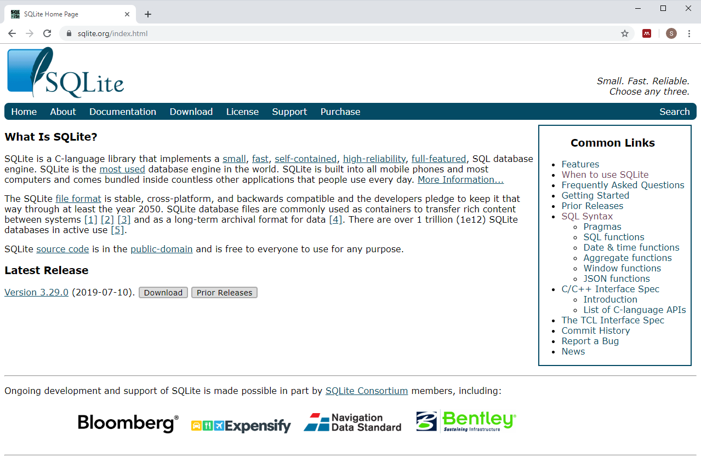

## A bad counting joke

+ There are 10 types of programmers, those who understand binary and those who don't
+ The heart of most EHR research is counting.
  + Count -> Percentage -> Odds ratio -> Logistic regression -> ???
+ Logistic regression and beyond requires SAS, SPSS, R, etc.
+ How do you get data into R?
  + SQL interface

## Access via i2b2 software


<div class="notes">

</div>

## Features of i2b2 software
+ Point and click interface
+ Easy to find things
+ Save, share, and re-use queries
+ Data builder
  + Creates and stores SQLite files

## What is SQLite?



## SQLite description


## SQLite is self-contained


## RSQLite package


## Sample R code

```
library(RSQLite)
db_name <- 
table_name <- 
sql_query <- paste("select * from", table_name)
conn_site <- dbConnect(SQLite(), dbname=db_name)
imported_data <- dbGetQuery(conn_site, sql_query)
```

## Oracle description


## Oracle is a sophisticated server application


## The i2b2 database schema


## Sample R code (1/5)


## Sample R code (2/5)


## Sample R code (3/5)

```
``{r login-to-oracle}
library("ROracle")
cdm_config <- read.csv('../cdm_config.csv', stringsAsFactors=FALSE)
c_connect <- dbConnect(
  Oracle(),
  cdm_config$account, 
  cdm_config$password, 
  cdm_config$access)
``
```

## Sample R code (4/5)

```
``{r simple-test}
dbGetQuery(c_connect, 
  "SELECT COUNT(patient_num)
     FROM blueherondata.observation_fact")
``
```

## Sample R code (5/5)

```
``{sql test-direct-access, 
     connection=c_connect,
     output.var="total_count"}
SELECT COUNT(patient_num) 
  FROM blueherondata.observation_fact
``
```

## When to use what
+ Databuilder and RSQLite
  + Well-defined hypothesis
  + Single static dataset
  + Small and moderate sized
+ Oracle and ROracle
  + Exploratory analyses
  + Multiple dynamic datasets
  + Large size
  
## Other consideratons for Oracle and ROracle
+ Do as much as you can in SQL
+ Baby steps
+ Watch your timing
  + Sys.time()
  + tictoc library
+ Be prepared to approach differently

## Where you can find a copy of this talk.

This presentation was developed using R Markdown. You can find all the important stuff at

* https://github.com/kumc-bmi/heron-i2b2-analytics

In particular, look for

* talks/sql-into-r/slides.pptx
* talks/sql-into-r/speaker-notes.pdf

